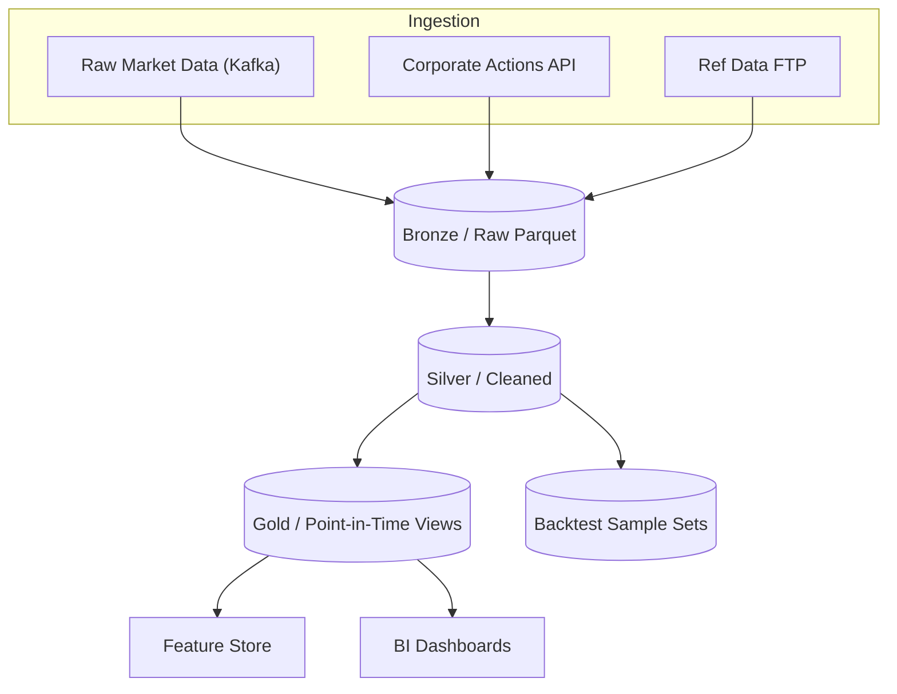

# Data Lineage Diagram

**Key Concepts**

* **Bronze**: as-is landing zone, schema-on-read.
* **Silver**: validated, de-duplicated, conforming types; bad-tick filter applied here.
* **Gold**: point-in-time adjusted views (corporate-actions, survivorship-safe).

All downstream consumers (research, OMS, risk) *must* source from **Gold** to guarantee historical integrity.
